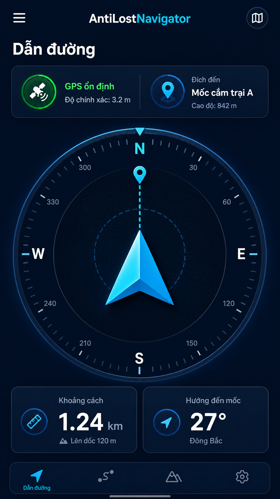
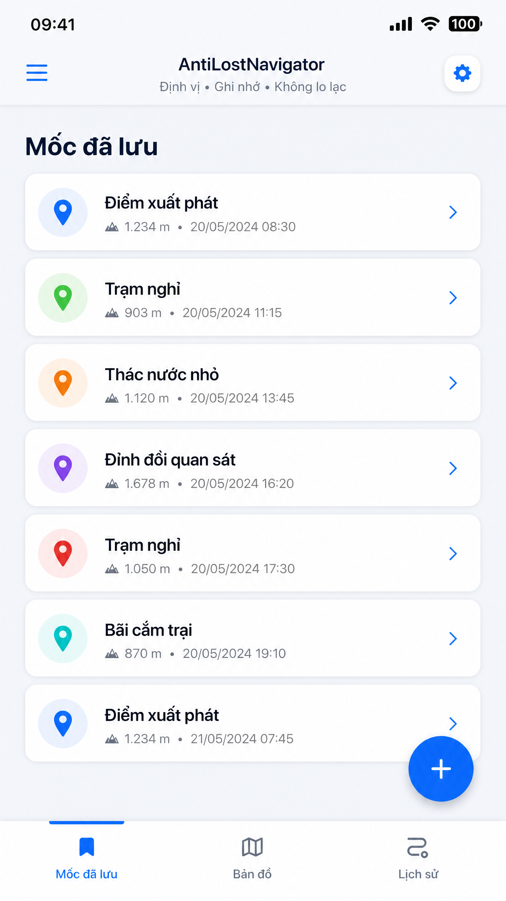

# AntiLostNavigator

> **Offline navigation for the moments when the trail disappears.**  
> **Dẫn đường ngoại tuyến cho những lúc bạn cần tìm đường trở về.**

AntiLostNavigator là ứng dụng Expo/React Native hỗ trợ định hướng ngoài trời bằng **GPS waypoint**, **la bàn bù nghiêng** và **bản đồ vệ tinh ngoại tuyến**. Ứng dụng được thiết kế cho trekking, dã ngoại và các hành trình có thể mất kết nối di động.

## Screenshots / Ảnh minh họa

Các hình dưới đây là **preview minh họa giao diện** cho bản phát hành stable; giao diện thực tế có thể thay đổi nhẹ tùy kích thước màn hình và dữ liệu GPS.

| Navigation / Dẫn đường | Saved markers / Mốc đã lưu | Offline map / Bản đồ ngoại tuyến |
|---|---|---|
|  |  |  |

## Features / Tính năng

### Navigation and compass

- Hiển thị hướng tới waypoint bằng mũi tên điều hướng rõ ràng.
- La bàn sử dụng **magnetometer** kết hợp **DeviceMotion** để bù góc nghiêng khi cầm điện thoại ở nhiều tư thế.
- Áp dụng **magnetic declination** để cải thiện độ chính xác theo khu vực.
- Hiển thị khoảng cách, phương vị, độ chính xác GPS và trạng thái cảm biến.

### GPS waypoints

- Theo dõi GPS liên tục trong lúc lấy vị trí mốc.
- Chờ đến khi độ chính xác đạt ngưỡng tốt trước khi lưu, thay vì chỉ lấy trung bình một số mẫu cố định.
- Lưu các mốc và breadcrumbs cục bộ bằng SQLite để có thể sử dụng khi không có mạng.

### Offline maps

- Bundle bản đồ cục bộ bao phủ Việt Nam ở các mức zoom chính.
- Hỗ trợ lớp **satellite** và **street**.
- Dùng cache cục bộ cho các mức zoom cao hơn khi thiết bị có dữ liệu bản đồ tương ứng.
- Bộ tile được Metro bundler đóng gói thông qua `assets/tiles/bundleIndex.js` và cấu hình mở rộng trong `metro.config.js`.

### UI and data

- Giao diện dẫn đường dark theme tập trung vào khả năng đọc ngoài trời.
- Các màn hình dữ liệu sử dụng light theme, bố cục rõ ràng và thao tác gọn.
- Các khu vực chính gồm Navigation, Markers, Time và 2D Map.

## Tech stack

| Thành phần | Công nghệ |
|---|---|
| Framework | Expo SDK 54 |
| Runtime | React Native 0.81.5, React 19.1 |
| Location | `expo-location` |
| Sensors | `expo-sensors` — Magnetometer, DeviceMotion |
| Local database | `expo-sqlite` |
| File and tile cache | `expo-file-system` |
| Graphics | `react-native-svg` |
| Map renderer | Custom SVG-based offline renderer |
| Target | Android-first; Expo development workflow |

## Requirements

- Node.js 20+ và npm hoặc pnpm.
- Android Studio, Android SDK và JDK 17 nếu build native Android tại máy.
- Thiết bị Android có GPS, magnetometer và accelerometer để kiểm tra đầy đủ tính năng.
- Quyền truy cập vị trí khi dùng ứng dụng ngoài trời.

## Getting started

```bash
npm install
npx expo start
```

Để chạy trên Android bằng native build:

```bash
npx expo run:android
```

Có thể mở project bằng Expo Go cho các phần không yêu cầu native build đầy đủ; để kiểm thử GPS, cảm biến và bundle tile sát với bản phát hành, nên dùng development build hoặc APK native trên thiết bị thật.

## Release configuration

Bản stable hiện tại:

| Trường | Giá trị |
|---|---|
| App version | `1.0.0` |
| Android version code | `1` |
| Expo SDK | `54` |

Thông tin version được quản lý trong `package.json` và `app.json`.

## Project structure

```text
AntiLostNavigator/
├── App.js                         # Application UI and navigation logic
├── app.json                       # Expo app metadata and native permissions
├── index.js                       # Expo entry point
├── metro.config.js                # Tile asset extensions for Metro
├── assets/
│   └── tiles/                     # Bundled offline map tiles and index
├── docs/screenshots/              # README UI preview images
├── package.json                   # Scripts and dependencies
└── README.md
```

## Sensor and privacy notes

AntiLostNavigator is intended to work locally on the device. GPS coordinates, markers and breadcrumb data are stored locally for offline use. The app requests location access because navigation depends on the device's position; users should review Android permission prompts and avoid relying on the app as the only safety system during remote travel.

Compass accuracy depends on the device's magnetometer, local magnetic interference and calibration. For best results, keep the phone away from metal objects and perform a gentle figure-eight calibration when the heading appears unstable.

## Building a release APK

For a local Android build, make sure the Android SDK and JDK 17 are configured, then run:

```bash
npx expo prebuild --platform android
npx expo run:android --variant release
```

Generated native folders and build outputs are intentionally excluded from Git through `.gitignore`. Keep release binaries in a separate release storage location rather than committing them to the source repository.

## Contributing

Issues and pull requests are welcome. Before opening a pull request, test the changes on a real Android device with location and sensor permissions enabled, and describe whether the test used online or fully offline map data.

## License

No open-source license has been selected yet. Until a license file is added, all rights are reserved by the project owner.

---

## Tiếng Việt

AntiLostNavigator là một ứng dụng dẫn đường **không phụ thuộc hoàn toàn vào Internet**, phù hợp cho trekking, dã ngoại và các tình huống cần quay lại theo các mốc đã lưu. Ứng dụng kết hợp GPS, cảm biến từ trường, cảm biến chuyển động và dữ liệu tile bản đồ được nhúng sẵn.

Bản phát hành chính thức hiện tại là **1.0.0 Stable**. Khi phát hành, nên kiểm tra trên thiết bị thật vì chất lượng la bàn và GPS phụ thuộc vào phần cứng, môi trường nhiễu từ và điều kiện bầu trời.
