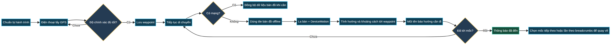

# AntiLostNavigator

> **Biết mình đang ở đâu. Biết mình cần đi hướng nào. Biết cách quay về.**

AntiLostNavigator là ứng dụng hỗ trợ định hướng ngoài trời dành cho trekking, dã ngoại và những hành trình có nguy cơ mất kết nối di động. Ứng dụng giúp người dùng lưu lại các mốc quan trọng, xác định hướng đi tới từng mốc bằng GPS và la bàn, đồng thời tiếp tục xem bản đồ ngay cả khi không còn Internet.

Ứng dụng không thay thế bản đồ địa hình, thiết bị cứu hộ hoặc kỹ năng sinh tồn. Mục tiêu của AntiLostNavigator là cung cấp một lớp hỗ trợ định hướng đơn giản, rõ ràng và hoạt động cục bộ trên điện thoại khi người dùng cần tìm đường trở lại.

## AntiLostNavigator giúp người dùng như thế nào?

Khi đi vào khu vực xa khu dân cư, người dùng có thể mất sóng điện thoại, không mở được bản đồ trực tuyến hoặc khó nhớ chính xác đường đã đi. AntiLostNavigator giải quyết tình huống này bằng cách lưu các waypoint và breadcrumbs ngay trên thiết bị, sau đó dùng vị trí hiện tại để tính khoảng cách và phương hướng tới điểm cần đến.



### Một tình huống sử dụng điển hình

Trước khi rời điểm xuất phát, người dùng mở ứng dụng và chờ GPS đạt độ chính xác phù hợp. Người dùng có thể lưu điểm xuất phát, nơi cắm trại, nguồn nước hoặc các điểm rẽ dưới dạng waypoint. Trong quá trình di chuyển, ứng dụng ghi nhận hành trình và giữ dữ liệu trong bộ nhớ cục bộ.

Nếu mạng bị mất, bản đồ đã được bundle trong ứng dụng vẫn có thể hiển thị. Khi người dùng chọn một waypoint, ứng dụng tính bearing và khoảng cách từ vị trí hiện tại tới waypoint. La bàn kết hợp cảm biến từ trường với cảm biến chuyển động để bù góc nghiêng, giúp mũi tên định hướng hữu ích hơn khi điện thoại không được giữ hoàn toàn phẳng.

| Vấn đề ngoài thực địa | Cách AntiLostNavigator hỗ trợ |
|---|---|
| Không có Internet | Dùng dữ liệu bản đồ offline đã được nhúng và cache cục bộ. |
| Không nhớ đường quay về | Lưu waypoint và breadcrumbs để chọn lại các điểm đã đi qua. |
| Không biết nên đi hướng nào | Tính bearing, khoảng cách và hiển thị hướng tới waypoint. |
| GPS dao động | Theo dõi liên tục và chỉ lưu mốc khi độ chính xác đạt mức phù hợp. |
| Cầm điện thoại bị nghiêng | Kết hợp Magnetometer và DeviceMotion để bù nghiêng la bàn. |
| Muốn kiểm tra hành trình | Lưu dữ liệu cục bộ bằng SQLite để xem lại trong ứng dụng. |

## Các chức năng chính

### Dẫn đường tới waypoint

Màn hình Dẫn đường hiển thị trạng thái GPS, độ chính xác vị trí, hướng hiện tại, hướng tới waypoint, khoảng cách và cảnh báo lệch hướng. Người dùng có thể chọn từng mốc trong danh sách và hủy dẫn đường bất kỳ lúc nào.

### Lưu mốc chính xác hơn

Thay vì lấy một số ít mẫu GPS rồi lưu ngay, ứng dụng duy trì watcher trong thời gian ngắn để chờ vị trí ổn định. Khi đạt độ chính xác tốt, người dùng có thể lưu tên, ghi chú và ảnh của mốc. Các waypoint được lưu cục bộ để không phụ thuộc vào máy chủ bên ngoài.

### Bản đồ offline

Ứng dụng sử dụng bộ tile được bundle sẵn cho khu vực Việt Nam ở các mức zoom chính, hỗ trợ lớp bản đồ vệ tinh và đường phố. Bộ tile được Metro bundler quản lý thông qua `assets/tiles/bundleIndex.js`; các mức zoom cao hơn có thể sử dụng cache cục bộ khi dữ liệu đã tồn tại trên thiết bị.

### Theo dõi thời gian và dữ liệu chuyến đi

Màn hình Thời gian cung cấp thông tin giờ UTC, giờ địa phương và dữ liệu mặt trời để hỗ trợ người dùng ước lượng điều kiện ánh sáng trong hành trình. Breadcrumbs, waypoint và thông tin GPS được quản lý cục bộ bằng SQLite.

## Công nghệ sử dụng

| Thành phần | Công nghệ |
|---|---|
| Framework | [Expo SDK 54](https://docs.expo.dev/) |
| Runtime | React Native 0.81.5, React 19.1 |
| Vị trí | `expo-location` |
| Cảm biến | `expo-sensors` — Magnetometer và DeviceMotion |
| Cơ sở dữ liệu cục bộ | `expo-sqlite` |
| Lưu tile và file | `expo-file-system` |
| Đồ họa | `react-native-svg` |
| Bộ dựng bản đồ | Custom SVG-based offline map renderer |
| Nền tảng mục tiêu | Android-first, Expo native workflow |

## Cài đặt và chạy thử

Yêu cầu Node.js 20 trở lên, JDK 17 và Android SDK nếu cần build native Android.

```bash
npm install
npx expo start
```

Để chạy native Android trên thiết bị hoặc emulator:

```bash
npx expo run:android
```

Để kiểm thử đúng GPS, cảm biến và bản đồ offline, nên dùng development build hoặc APK trên thiết bị Android thật. Expo Go phù hợp cho việc kiểm tra nhanh các phần giao diện và logic không phụ thuộc đầy đủ vào native build.

## Build bản release

```bash
npx expo prebuild --platform android
npx expo run:android --variant release
```

Các thư mục native sinh tự động và file build không được commit vào repository. APK/AAB nên được lưu ở kênh phát hành riêng như GitHub Releases.

## Cấu trúc project

```text
AntiLostNavigator/
├── App.js                         # Logic, màn hình và style chính
├── app.json                       # Metadata Expo và native permissions
├── index.js                       # Entry point
├── metro.config.js                # Cấu hình asset tile cho Metro
├── assets/
│   └── tiles/                     # Tile bản đồ offline đã bundle
├── docs/
│   ├── antilost-workflow.mmd      # Source của biểu đồ hoạt động
│   └── antilost-workflow.png      # Biểu đồ dùng trong README
├── package.json
└── README.md
```

## Độ chính xác và an toàn khi sử dụng

Độ chính xác GPS phụ thuộc vào thiết bị, điều kiện bầu trời, môi trường và chất lượng tín hiệu. La bàn có thể bị ảnh hưởng bởi kim loại, nam châm, loa hoặc thiết bị điện tử gần điện thoại. Khi hướng hiển thị không ổn định, hãy di chuyển khỏi nguồn nhiễu và hiệu chỉnh cảm biến bằng chuyển động hình số tám.

Không nên chỉ dựa vào AntiLostNavigator trong các chuyến đi nguy hiểm. Người dùng nên mang theo bản đồ dự phòng, pin dự phòng, đèn, nước, thiết bị liên lạc và thông báo lịch trình cho người khác trước khi khởi hành.

## Quyền riêng tư

GPS, waypoint, breadcrumbs và dữ liệu chuyến đi được lưu cục bộ trên thiết bị để hỗ trợ hoạt động offline. Ứng dụng cần quyền vị trí vì đây là dữ liệu cốt lõi của chức năng dẫn đường. Người dùng nên xem lại các quyền Android trước khi sử dụng.

## Phiên bản stable

| Trường | Giá trị |
|---|---|
| App version | `1.0.0` |
| Android version code | `1` |
| iOS build number | `1` |
| Expo SDK | `54` |

## Đóng góp

Issue và pull request được hoan nghênh. Khi báo lỗi, hãy mô tả thiết bị, phiên bản Android, trạng thái kết nối mạng, độ chính xác GPS và liệu lỗi có xảy ra trong chế độ bản đồ offline hay không.

## License

Project chưa chọn giấy phép mã nguồn mở. Cho đến khi thêm file license, mọi quyền thuộc về chủ sở hữu project.

## References

- [1] [Expo Documentation](https://docs.expo.dev/) — Tài liệu chính thức của Expo.
- [2] [React Native Documentation](https://reactnative.dev/docs/getting-started) — Tài liệu chính thức của React Native.
